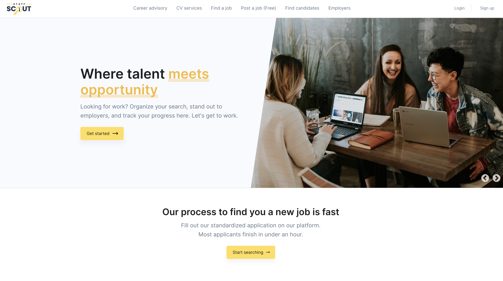

## Staffscouts

    Staffscout job portal

### Development set up

1. Install [`Node JS`](https://nodejs.org/en/).
2. To clone, run `git clone https://github.com/kamyaD/StaffScouts-fronted.git`.
3. `cd` into the root of the **project directory**.
4. Install [`yarn`](https://yarnpkg.com/en/docs/install#mac-stable).
5. Run `yarn install` on the terminal to install dependencies.
6. Create a `.env.local` file in the root directory of the application. Example of the content of a `.env.local` file is shown in the `.env.example`
7. Setup local development server.

### Development server

Run `yarn dev` for a dev server. Navigate to `http://127.0.0.1:3000/`. The app will automatically reload if you change any of the source files.

### Build

Run `yarn build` to build the project. The build artifacts will be stored in the `.next` directory

## Learn More

To learn more about Next.js, take a look at the following resources:

- [Next.js Documentation](https://nextjs.org/docs) - learn about Next.js features and API.
- [Learn Next.js](https://nextjs.org/learn) - an interactive Next.js tutorial.

You can check out [the Next.js GitHub repository](https://github.com/vercel/next.js/) - your feedback and contributions are welcome!
